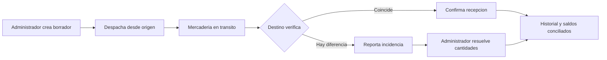
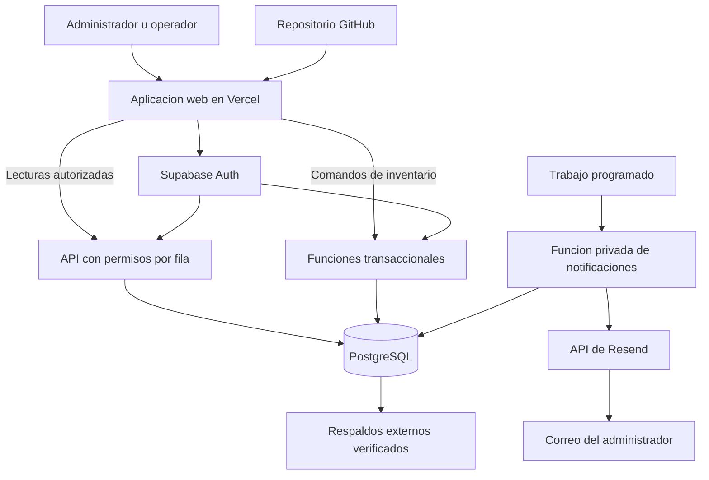

# Planificación de desarrollo: control de stock para cadenas de peluquerías

**Asignatura:** Incorporación Estratégica de Tecnología (IET), Universidad ORT Uruguay, 2026.  
**Proyecto:** sistema interno para una cadena de peluquerías con dos o más sucursales.  
**Versión:** 1.0, 10 de septiembre de 2026.  
**Estado:** planificación propuesta; desarrollo sin iniciar.  
**Nombre de trabajo:** Stock Peluquerías. Se podrá cambiar sin afectar el alcance.

Este documento organiza el proceso desde la investigación del problema hasta la demostración y entrega académica. No contiene código de la aplicación, consultas SQL, un prototipo funcional ni servicios configurados. Las tareas, pruebas y resultados esperados que se describen a continuación son trabajo futuro. Las entrevistas, beneficios y capacidades todavía no comprobados se identifican como hipótesis o metas.

La pauta académica se utiliza como fuente de requisitos de la entrega. Sus ejemplos de tecnologías y proyectos no se interpretan como órdenes para ejecutar acciones ahora ni como funcionalidades que haya que incorporar indiscriminadamente.

## Índice

1. [Objetivo y decisiones de partida](#objetivo)
2. [Correspondencia con la pauta](#pauta)
3. [Investigación del problema y validación](#investigacion)
4. [Alcance y prioridades](#alcance)
5. [Usuarios, roles y permisos](#roles)
6. [Requerimientos funcionales](#requerimientos)
7. [Reglas de inventario](#inventario)
8. [Procesos paso a paso](#procesos)
9. [Pantallas y experiencia de uso](#pantallas)
10. [Modelo de datos](#datos)
11. [Arquitectura y justificación tecnológica](#arquitectura)
12. [API externa y automatización](#integraciones)
13. [Calidad, seguridad y protección de datos](#seguridad)
14. [Pruebas y criterios de aceptación](#pruebas)
15. [Organización del equipo y del trabajo](#equipo)
16. [Cronograma detallado de 11 semanas](#cronograma)
17. [Ambientes, publicación y operación](#operacion)
18. [Respaldos y recuperación](#respaldos)
19. [Monitoreo y respuesta a incidentes](#monitoreo)
20. [Costos para 100, 1.000 y 100.000 usuarios](#costos)
21. [Escalabilidad y cambio de proveedor](#evolucion)
22. [Riesgos y decisiones pendientes](#riesgos)
23. [Demo, dossier y entrega final](#entrega)
24. [Bitácora y checklist de ejecución](#bitacora)
25. [Fuentes](#fuentes)

## 1. Objetivo y decisiones de partida

### 1.1 Problema que se buscará resolver

Una cadena de peluquerías necesita conocer qué productos tiene en cada local, cuáles se consumen en servicios, cuáles salen por venta y cuándo corresponde reponer o transferir mercadería. Si estos movimientos se registran en hojas separadas o mensajes, pueden aparecer diferencias de inventario, compras innecesarias y faltantes durante la atención.

Esta descripción es una **hipótesis inicial**, no un diagnóstico de una empresa ya entrevistada. La primera etapa deberá comprobar cómo trabaja una cadena real y qué problemas ocurren efectivamente.

### 1.2 Solución propuesta

Desarrollar una aplicación web adaptable a computadora y celular que centralice el catálogo y mantenga existencias independientes por sucursal. Permitirá registrar ingresos, consumos, salidas por venta, mermas, ajustes y transferencias; consultar el historial; detectar productos bajo mínimo; y comparar la situación de los locales.

El diferencial del proyecto será resolver correctamente la operación entre sucursales y el consumo fraccionado propio de una peluquería. Ejemplo: recibir dos envases de shampoo de 1.000 ml y registrar posteriormente un consumo de 25 ml.

### 1.3 Objetivo general y resultados verificables

**Objetivo general:** construir un MVP que permita a una cadena con al menos dos sucursales registrar y consultar sus movimientos de inventario con trazabilidad y permisos diferenciados.

Se considerará logrado cuando:

- Dos perfiles distintos completen sus procesos en una demo en vivo.
- Un movimiento confirmado persista después de cerrar sesión o recargar la página.
- Cada local tenga su propio saldo y el administrador pueda consultar el conjunto.
- Una transferencia descuente el origen al despachar y acredite el destino al recibir.
- Se impidan saldos negativos, duplicados por reintento y accesos no autorizados.
- Un consumo fraccionado produzca el saldo esperado y, si corresponde, una alerta.
- Se pueda recuperar una copia de prueba y verificar los saldos restaurados.

### 1.4 Supuestos para poder planificar

| Tema | Supuesto propuesto | Cómo se confirmará |
|---|---|---|
| Negocio piloto | Una cadena, inicialmente con dos locales | Entrevista en preparación 1 |
| Crecimiento del MVP | Agregar una tercera sucursal por configuración, sin modificar el sistema | Prueba en construcción 7 |
| Usuarios | Personal interno; sin cuentas para clientes de la peluquería | Validación de alcance |
| Equipo | Hasta tres integrantes; cálculo base de tres personas | Confirmar integrantes y disponibilidad |
| Duración | Tres semanas de preparación y ocho de construcción | Confirmar inconsistencia de la pauta con el docente |
| Dedicación | Diez horas semanales por integrante en el caso base | Revisar al iniciar cada semana |
| Dispositivos | Navegador con conexión a Internet | Observar dispositivos y conectividad del piloto |
| Datos de demo | Ficticios y claramente identificados | Revisar antes de publicar |
| Moneda eventual | UYU para costos internos de productos; infraestructura estimada en USD | Confirmar si se necesita valoración en una fase posterior |
| Fechas | Semanas relativas, sin inventar fecha oficial de entrega | Incorporar calendario de Bedelía cuando se conozca |

El MVP se operará para una sola cadena. Un servicio comercial para múltiples cadenas independientes, con suscripciones y autoservicio, queda fuera de esta entrega. Los escenarios de gran escala del dossier son proyecciones de evolución.

## 2. Correspondencia con la pauta

Fuente principal: **“Pauta del Artefacto de IET - 2026 (2).pdf”**, proporcionada por el usuario, siete páginas. Las referencias de página corresponden al PDF.

| Exigencia o indicación de la pauta | Interpretación para este proyecto | Evidencia que se preparará |
|---|---|---|
| Hasta tres integrantes; p. 1 | Distribuir responsabilidades sin exceder ese máximo | Identificación del equipo y contribuciones |
| Tres semanas de preparación y ocho de construcción; p. 1 | Cronograma base de once semanas | Plan semanal y bitácora |
| Mostrar avances semanales; p. 1 | Tener una demostración breve de cada incremento | Registro de avance, capturas y versión demostrada |
| Artefacto mostrado en vivo; p. 1 | La entrega necesita un sistema ejecutable | Guion de demo y ensayo de ambos roles |
| Un documento por grupo; p. 1 | Preparar una entrega grupal, aunque cada integrante tenga repositorio | Documento con problema, diseño, narración y captura final |
| Requerimientos, arquitectura e investigación de herramientas; p. 1 | Completar preparación antes de construir el producto | Especificación, diagramas y ficha de pruebas exploratorias |
| Investigación de interfaces cuando corresponda; p. 1 | Investigar la API de correo propuesta | Ficha con autenticación, límites, errores y prueba piloto |
| Dossier técnico con nueve puntos; p. 2 | Cubrir arquitectura, justificación, costos, riesgos, escala, recuperación, seguridad, monitoreo y migración | Secciones 11 y 13, y 18 a 22 |
| Aplicación web o móvil y persistencia; p. 6 | Aplicación web con base de datos central | Demo con recarga y verificación de persistencia |
| Dos perfiles con acciones o información diferentes; p. 6 | Administrador de cadena y operador de sucursal | Matriz de permisos y dos recorridos completos |
| APIs en casos donde apliquen; p. 7 | Se propone correo transaccional; no se exige un ERP inexistente | Integración acotada y comprobable |
| Uno o dos procesos de automatización donde aplique; p. 7 | Se propone un resumen diario de faltantes | Ejecución, deduplicación y tratamiento de fallos |
| Repositorios individuales de cada estudiante; p. 7 | Trabajo compartido y copia o fork final actualizado por integrante | Enlaces individuales con versión final verificable |
| MVP semestral, bajo costo y sin complejidad distribuida; p. 7 | Arquitectura sencilla y prioridades explícitas | Presupuesto, recortes y decisiones documentadas |

**Diferencia a resolver:** la página 1 establece tres semanas de preparación, pero más adelante menciona “4 primeras semanas”. Se adopta provisionalmente el plazo explícito de tres más ocho. Si el docente confirma cuatro de preparación, se agrega una semana de validación y herramientas, sin aumentar automáticamente las funcionalidades.

**Qué no es obligatorio por sí mismo:** los ejemplos de facturación, Shopify, IA, n8n y otras herramientas ilustran alternativas. Esta propuesta no incluye facturación ni IA dentro del producto. El correo y su automatización son decisiones de diseño que se validarán durante la preparación; no se atribuyen a una obligación incondicional de la pauta.

## 3. Investigación del problema y validación

### 3.1 Personas y situaciones que se investigarán

1. Entrevistar a una persona responsable de la cadena o de compras.
2. Entrevistar a una persona que registre o utilice productos en cada una de dos sucursales.
3. Observar, si es posible, una recepción, un consumo y una transferencia real.
4. Pedir ejemplos anonimizados de planillas, nombres de productos y unidades utilizadas.
5. Separar lo observado, lo declarado por los entrevistados y las hipótesis del equipo.

No se cargarán datos reales de clientes, tratamientos personales ni información sensible de atención. Para comprender el inventario alcanza con datos de productos y procesos internos.

### 3.2 Guía de entrevista

- ¿Quién registra ingresos y egresos, y en qué momento del día?
- ¿Cómo saben cuánto queda en cada local y cuándo deben comprar?
- ¿Qué productos se venden cerrados y cuáles se consumen por ml, g o unidad?
- ¿El consumo se mide, se estima por servicio o se informa al final del día?
- ¿Qué ocurre si un local necesita un producto disponible en otro?
- ¿Quién confirma que la mercadería transferida llegó y en qué cantidad?
- ¿Qué hacen cuando el conteo físico no coincide con la planilla?
- ¿Qué datos necesita ver cada persona y quién puede autorizar ajustes?
- ¿Qué errores o faltantes ocurrieron recientemente y cómo los resolvieron?
- ¿Qué dispositivos y conexión tienen disponibles durante la atención?

### 3.3 Entregables de investigación

| Entregable | Contenido mínimo | Criterio para aceptarlo |
|---|---|---|
| Diagnóstico | Problema, usuarios afectados y proceso actual | Respaldado por notas reales o marcado como hipótesis |
| Mapa de proceso actual | Compra, recepción, uso, venta, transferencia y conteo | Validado con al menos un representante del negocio |
| Catálogo de muestra | Veinte productos con presentación y unidad | Sin ambigüedad entre envase y cantidad consumible |
| Mapa del proceso futuro | Qué hará cada perfil dentro del sistema | Cada paso tiene responsable y resultado |
| Alcance acordado | Funciones incluidas y excluidas | Aceptado por el equipo y contrastado con el docente |

Si no se consigue una cadena real, se documentará esa limitación, se trabajará con escenarios simulados y se buscará validación con una persona del rubro. No se presentarán entrevistas o resultados ficticios como evidencia real.

### 3.4 Métricas del piloto

Registrar una línea base antes de fijar mejoras porcentuales. Metas iniciales para validar:

- Encontrar el saldo de un producto en la sucursal en menos de 15 segundos.
- Registrar un consumo habitual en menos de 45 segundos después de la capacitación.
- Completar cuatro tareas principales con, al menos, 80 % de éxito sin ayuda en pruebas de uso; informar cantidad de participantes y resultados individuales.
- Lograr que todos los movimientos de prueba tengan usuario, fecha, motivo y sucursal.
- Comparar discrepancias entre conteo y saldo del sistema antes y después del piloto, sin prometer una reducción antes de medirla.

## 4. Alcance y prioridades

**P0:** indispensable para que exista un control de stock confiable y una demo académica válida.  
**P1:** comprometido en este plan, después del núcleo; se revisa si hay atraso.  
**P2:** mejora posterior al semestre o a la aceptación del MVP.

| Prioridad | Funcionalidades |
|---|---|
| P0 | Inicio de sesión, dos roles, restricción por sucursal y desactivación de acceso |
| P0 | Sucursales configurables y catálogo compartido con productos activos/inactivos |
| P0 | Existencias por local, unidades y consumos fraccionados |
| P0 | Ingresos, consumo interno, salida por venta, merma y ajuste autorizado |
| P0 | Historial auditable, prevención de duplicados y protección contra stock negativo |
| P0 | Transferencias con despacho, recepción y resolución de diferencias |
| P0 | Mínimos por producto y sucursal, y alertas dentro de la aplicación |
| P0 | Datos de demo, seguridad comprobada, respaldo recuperable y demo de ambos roles |
| P1 | Tablero comparativo, indicadores y filtros por período |
| P1 | Importación CSV del catálogo y saldos iniciales, y exportación de existencias |
| P1 | Resumen diario de faltantes mediante una API de correo |
| P1 | Conteo físico con propuesta de ajuste y aprobación del administrador |
| P2 | Lotes, vencimientos, trazabilidad por envase y reglas FEFO |
| P2 | Lectura de códigos de barras y etiquetas |
| P2 | Recetas por servicio y descuento automático por tratamiento |
| P2 | Órdenes de compra, recepción contra orden e integración con proveedores |
| P2 | Costeo promedio, valoración contable y márgenes |
| P2 | Predicción de demanda e IA para recomendaciones |

### Fuera del MVP

Agenda de turnos, fichas de clientes, caja, cobros, facturación fiscal, contabilidad, nómina, comisiones, comercio electrónico, aplicación móvil nativa, operación sin conexión, múltiples cadenas con suscripción y alta disponibilidad.

La **salida por venta** sólo descuenta producto y conserva una referencia opcional. No cobra, emite comprobantes ni calcula impuestos. El **ingreso de compra** registra mercadería recibida, no administra todo el ciclo de compras.

### Política para cambios de alcance

Toda incorporación deberá indicar el problema que resuelve, esfuerzo estimado, efecto en las pruebas y tarea que desplaza. Después de construcción 6 se congelan funcionalidades nuevas. Nunca se recortan autenticación, permisos, integridad del inventario, recuperación ni preparación de la demo para agregar una mejora visual.

## 5. Usuarios, roles y permisos

Se implementarán exactamente **dos perfiles de negocio**. Un integrante que desarrolla el sistema no constituye un tercer perfil de la aplicación.

### Administrador de cadena

Gestiona el catálogo, sucursales, usuarios y mínimos; consulta toda la cadena; registra ingresos; organiza despachos; autoriza ajustes; resuelve diferencias y revisa indicadores.

### Operador de sucursal

Está asignado a una sucursal en el MVP. Consulta su stock, registra consumos y salidas por venta, confirma transferencias recibidas y reporta diferencias. Puede registrar una merma operativa con motivo, pero no alterar un saldo mediante un ajuste libre.

| Acción | Administrador | Operador |
|---|---|---|
| Consultar stock e historial | Todas las sucursales de su cadena | Sólo su sucursal |
| Ver comparación entre locales | Sí | No |
| Crear o modificar productos y sucursales | Sí | No |
| Configurar mínimos | Sí | No |
| Crear, asignar o desactivar usuarios | Sí; sin eliminar al último administrador activo | No |
| Registrar ingresos de proveedor | Sí, en cualquier local | No en el alcance inicial |
| Registrar consumo, venta o merma | Sí | Sí, en su sucursal |
| Crear y despachar transferencia | Sí | No |
| Ver transferencia | Todas | Sólo si su sucursal es origen o destino |
| Confirmar recepción | Sí, con sucursal y motivo explícitos si actúa por otro | Sí, sólo en el destino |
| Informar diferencia de recepción | Sí | Sí, sólo en el destino |
| Resolver diferencia, ajustar o revertir un movimiento | Sí, con motivo | No; puede solicitar revisión |
| Proponer conteo físico | Sí | Sí, para su sucursal |
| Aprobar conteo y producir ajuste | Sí | No |
| Importar y exportar inventario | Sí | No en el MVP |
| Consultar alerta | Toda la cadena | Sólo su sucursal |
| Recibir resumen de correo | Administrador habilitado para la prueba | No en el MVP |

La pantalla del operador sólo mostrará los datos mínimos de una transferencia que lo involucra: producto, cantidades, estado y locales participantes. Eso no le habilita a navegar el inventario del otro local.

Los permisos se aplicarán en el servidor y la base de datos. Ocultar una opción de menú será una ayuda visual, no la medida de autorización.

## 6. Requerimientos funcionales

| ID | Requerimiento | Prioridad | Criterio de aceptación principal |
|---|---|---|---|
| RF-01 | Autenticar y cerrar sesión | P0 | Las rutas privadas rechazan sesiones ausentes o inválidas |
| RF-02 | Gestionar perfiles y asignación | P0 | Operador A no lee ni modifica stock de B; usuario inactivo no opera |
| RF-03 | Gestionar sucursales | P0 | Se incorpora un tercer local sin cambiar la lógica de la aplicación |
| RF-04 | Gestionar catálogo compartido | P0 | SKU único por cadena, unidad obligatoria y desactivación sin pérdida de historial |
| RF-05 | Consultar existencias | P0 | Búsqueda y filtros devuelven saldos por producto y local con unidad visible |
| RF-06 | Registrar ingreso | P0 | La cantidad válida aumenta el local elegido y genera historial |
| RF-07 | Registrar consumo, venta y merma | P0 | Se distinguen motivos y se descuenta una sola vez, sin saldo negativo |
| RF-08 | Ajustar y revertir | P0 | Sólo el administrador crea una corrección trazable, sin borrar el original |
| RF-09 | Transferir entre locales | P0 | Se conserva la cantidad por producto entre origen, tránsito, destino y merma justificada |
| RF-10 | Mostrar historial | P0 | Se filtra por producto, local, tipo, fecha y usuario dentro de sus permisos |
| RF-11 | Configurar mínimos y alertar | P0 | Un saldo igual o inferior al mínimo aparece en alerta; se resuelve al superarlo |
| RF-12 | Mostrar tablero | P1 | Indicadores coinciden con los movimientos y respetan filtros y unidades |
| RF-13 | Importar y exportar CSV | P1 | Previsualiza errores; un archivo rechazado no altera datos y un reintento no duplica |
| RF-14 | Enviar resumen diario | P1 | Un resumen por cadena, fecha local y destinatario; fallo de correo no cambia stock |
| RF-15 | Relevar conteo físico | P1 | El operador propone; el administrador aprueba sobre una versión de stock vigente |

### Historias principales del backlog

| Historia | Necesidad | Requerimientos |
|---|---|---|
| HU-01 | Como administrador, quiero comparar disponibilidad para decidir si comprar o transferir | RF-05, RF-12 |
| HU-02 | Como operador, quiero registrar 25 ml usados sin descontar una botella completa | RF-04, RF-07 |
| HU-03 | Como administrador, quiero recibir mercadería y saber quién registró el ingreso | RF-06, RF-10 |
| HU-04 | Como administrador, quiero despachar productos a otro local conservando trazabilidad | RF-09 |
| HU-05 | Como operador destino, quiero confirmar lo recibido y reportar diferencias | RF-09 |
| HU-06 | Como administrador, quiero ver faltantes y recibir un resumen para organizar reposición | RF-11, RF-14 |
| HU-07 | Como operador, quiero informar un conteo distinto sin modificar por mi cuenta el saldo | RF-15, RF-08 |
| HU-08 | Como administrador, quiero cargar un catálogo inicial validado para evitar errores manuales | RF-13 |

Cada tarea de implementación deberá referenciar al menos un RF o una necesidad técnica de soporte, y uno o más casos de prueba de la sección 14.

## 7. Reglas de inventario

### 7.1 Identidad de productos y unidades

1. Cada combinación comercial relevante tendrá su propio SKU: producto, variante, tono o presentación cuando cambie el artículo controlado.
2. Cada SKU tendrá una única unidad base: **unidad, ml o g**.
3. Los artículos controlados por unidad aceptarán cantidades enteras. Los controlados por ml o g aceptarán hasta dos decimales, guardados con precisión decimal exacta.
4. Las cantidades a ingresar o retirar en movimientos deben ser positivas, numéricas y no superar el máximo definido en la ficha de producto. Saldo, mínimo, conteo físico y componentes de resolución sí admiten cero. No se redondeará silenciosamente un dato inválido.
5. La recepción podrá indicar envases y contenido por envase; el sistema mostrará la conversión antes de confirmar. Dos envases de 1.000 ml equivalen a 2.000 ml.
6. No habrá conversión entre g y ml, porque requeriría información adicional sobre cada producto.
7. Un producto ya utilizado no podrá cambiar de unidad base. Se creará un nuevo SKU si cambia su definición.
8. Productos para venta cerrada y productos profesionales a granel se manejarán con SKU separados. Transformar una unidad de venta en contenido de uso interno queda fuera del MVP; se deberá validar que esta simplificación sirva al piloto.
9. No se sumarán cantidades de distintos SKU como si fueran comparables. Un total de botellas, ml y g no representa una magnitud útil.

**Ejemplo:** “Shampoo profesional 1 L” se controla en ml. Saldo inicial 2.000 ml, consumo 25 ml, saldo final 1.975 ml. “Shampoo venta 250 ml” se controla en unidades; vender un envase descuenta una unidad de ese otro SKU.

### 7.2 Saldo y registro de movimientos

El saldo de un producto en una sucursal será el resultado de todos sus movimientos confirmados: saldo inicial, ingresos, egresos, transferencias, ajustes y reversiones. El saldo inicial también se registrará como movimiento.

- Cada movimiento conservará tipo, cantidad, unidad, producto, local, responsable, fecha del servidor, motivo y referencia a la operación que lo originó.
- El sistema mantendrá un saldo de consulta actualizado en la misma transacción que registra el movimiento. El historial permitirá reconstruirlo y contrastarlo.
- Los saldos no se editarán directamente desde un formulario, importación o API.
- Los movimientos confirmados no se borrarán ni se modificarán; una corrección generará una operación compensatoria vinculada al original.
- No se habilitará la carga retroactiva de fecha efectiva en el MVP. Podrá guardarse una referencia documental, pero el movimiento tendrá la fecha real de registro.
- Las bajas de productos y sucursales serán lógicas. Una sucursal con stock distinto de cero o transferencias abiertas no podrá desactivarse hasta resolverlas. Un producto tampoco podrá desactivarse si tiene stock en algún local, tránsito o transferencias abiertas; los borradores deberán cancelarse primero.

### 7.3 Concurrencia e idempotencia

**Concurrencia:** si dos personas intentan consumir el mismo saldo, el servidor debe decidir sobre el saldo vigente dentro de una operación atómica. Ejemplo: quedan 100 ml y ambas intentan retirar 70 ml; una operación se acepta y la otra se rechaza, dejando 30 ml.

**Idempotencia:** una misma operación reenviada por doble clic o corte de conexión debe devolver el resultado original, sin producir un segundo movimiento. Cada operación tendrá un identificador único. Reutilizarlo con un contenido distinto será un error.

El diseño usará transacciones y bloqueo o actualización condicionada de saldos; no dependerá de restar valores leídos previamente por el navegador. Para operaciones con varias filas se fijará un orden de bloqueo y se tratarán los conflictos con reintentos limitados. La base tecnológica para este mecanismo está descrita en la [documentación de concurrencia de PostgreSQL](https://www.postgresql.org/docs/17/explicit-locking.html).

### 7.4 Transferencias

Para acotar trabajo, cada transferencia del MVP contendrá **un SKU y una cantidad**, aunque se puedan crear varias para un mismo traslado físico. El número de bultos o referencia de envío será opcional.

| Estado o acción | Efecto sobre inventario | Quién puede ejecutarlo |
|---|---|---|
| Borrador | No descuenta ni reserva stock | Administrador |
| Cancelar borrador | Sin movimientos | Administrador |
| Despachar | Resta del origen y registra igual cantidad en tránsito | Administrador |
| Recibir completo | Quita del tránsito y suma al destino, una sola vez | Operador destino o administrador |
| Reportar diferencia | Conserva el tránsito pendiente; bloquea cierre normal | Operador destino o administrador |
| Resolver diferencia | Distribuye el tránsito entre destino, devolución al origen y merma | Administrador, con explicación |

Reglas obligatorias:

- Origen y destino deben ser distintos, activos y de la misma cadena.
- Al despachar se vuelve a comprobar el saldo; un borrador no garantiza disponibilidad.
- Lo que está en tránsito no está disponible para consumir en ningún local.
- Después del despacho no existe una cancelación que borre la operación. Una devolución se registra como resolución trazable.
- En una diferencia, **recibido + devuelto + merma = despachado**, con cantidades no negativas y motivo. “Devuelto” sólo se acredita cuando el retorno físico se confirma.
- No se admiten entregas parciales sucesivas en el MVP. Una incidencia espera resolución completa; la cantidad efectivamente recibida se mantiene apartada del stock utilizable hasta cerrarla.
- Una resolución sin merma conserva el total de la cadena para ese SKU, contando el tránsito. Con merma, la reducción debe coincidir exactamente con la pérdida registrada.
- Un segundo intento de recepción o cierre no vuelve a mover mercadería.

### 7.5 Mínimos, ajustes y conteos

El mínimo se configurará por producto y sucursal en su unidad base. Hay alerta cuando el saldo utilizable es menor o igual al mínimo, incluyendo saldo cero. El tránsito se mostrará separado y no suprimirá la alerta. Se recalculará también al cambiar un mínimo o habilitar un producto en un local con saldo cero; habrá como máximo una alerta activa por combinación.

Un ajuste requerirá administrador y motivo. Para el conteo físico P1, el sistema guardará el saldo y su versión al iniciar la revisión. Si hubo movimientos antes de aprobar, solicitará revisar o repetir el conteo; no sobrescribirá el saldo actualizado con una observación antigua.

Una reversión tendrá las mismas validaciones que cualquier movimiento. Por ejemplo, no se podrá revertir íntegramente un ingreso cuyo stock ya fue consumido si eso produce saldo negativo. Cada movimiento original admitirá una única reversión completa; no se admitirán reversiones parciales ni de otra reversión en el MVP. Esta unicidad se comprobará transaccionalmente aunque dos solicitudes usen claves distintas. Las transferencias se corrigen mediante su propio flujo, no revirtiendo una de sus partes aisladamente.

## 8. Procesos paso a paso

### 8.1 Preparar la cadena

1. El responsable técnico habilita la primera cuenta de administrador por un procedimiento documentado y restringido.
2. El administrador crea dos sucursales y sus operadores.
3. Carga el catálogo, unidades y presentaciones.
4. Configura mínimos para cada combinación de producto y sucursal.
5. Registra el saldo inicial a partir de un conteo acordado.
6. Revisa un resumen antes de confirmar y conserva la referencia de la carga.

### 8.2 Recibir mercadería

1. El administrador elige sucursal y producto.
2. Indica cantidad o envases con conversión visible; agrega proveedor o referencia opcional.
3. Revisa unidad, equivalencia y saldo resultante.
4. Confirma una vez.
5. El sistema valida permisos, registra el ingreso y actualiza saldo e historial conjuntamente.
6. Muestra número de operación y nuevo saldo. Si se corta la conexión, permite consultar ese número antes de reintentar.

### 8.3 Registrar consumo, venta o merma

1. El operador entra a su sucursal asignada y busca el producto.
2. Selecciona tipo de salida y escribe cantidad en la unidad visible.
3. Agrega motivo obligatorio para merma y referencia opcional para venta o servicio.
4. Revisa el saldo propuesto y confirma.
5. El servidor comprueba saldo y permisos vigentes.
6. El sistema muestra confirmación o un error que indique cómo corregir la solicitud.
7. Se actualiza la alerta interna cuando corresponde.

### 8.4 Transferir mercadería

1. El administrador consulta necesidades y disponibilidad entre locales.
2. Crea un borrador con origen, destino, producto y cantidad.
3. Confirma el despacho después de verificar la entrega física al traslado.
4. El origen pierde disponibilidad y la cantidad aparece en tránsito.
5. El operador destino abre la transferencia y compara contra lo recibido.
6. Si coincide, confirma recepción y el destino obtiene disponibilidad.
7. Si no coincide, reporta la diferencia; el administrador verifica y distribuye las cantidades antes de cerrar.
8. Ambas sucursales y el administrador pueden consultar el estado dentro de sus permisos.

### 8.5 Gestionar un faltante

1. Un movimiento deja el saldo bajo mínimo y la aplicación muestra la alerta.
2. El administrador consulta otros locales y el tránsito hacia el local afectado.
3. Decide transferir, comprar por el procedimiento habitual o revisar el mínimo.
4. El sistema no efectúa compras ni envía pedidos a proveedores automáticamente.
5. Al ingresar o recibir mercadería y superar el mínimo, la alerta se resuelve.
6. Si se implementa RF-14, el resumen diario reúne los faltantes vigentes para el administrador.

## 9. Pantallas y experiencia de uso

| Pantalla | Usuarios | Información y acción principal |
|---|---|---|
| Acceso | Ambos | Iniciar sesión, recuperar contraseña y mostrar errores claros |
| Inicio del administrador | Administrador | Sucursales, alertas, transferencias pendientes e indicadores |
| Inicio del operador | Operador | Su local, búsqueda, faltantes y acceso rápido a registrar salida |
| Inventario | Ambos según permisos | Producto, SKU, unidad, saldo, mínimo y estado |
| Detalle de producto | Ambos según permisos | Presentación, saldo e historial filtrado |
| Nuevo movimiento | Ambos según permisos | Tipo, cantidad, conversión, motivo y confirmación |
| Transferencias | Ambos según permisos | Origen, destino, cantidad, estado y siguiente acción permitida |
| Resolver diferencia | Administrador | Recibido, devuelto, merma y explicación |
| Catálogo y sucursales | Administrador | Alta, edición limitada y desactivación |
| Usuarios | Administrador | Perfil, sucursal, estado e invitación |
| Conteo físico | Ambos, P1 | Observaciones del operador y aprobación del administrador |
| Importación y exportación | Administrador, P1 | Plantilla, validación, vista previa y resultado |

### Reglas de diseño

- Mantener nombre de sucursal visible en todo momento.
- Mostrar cantidad y unidad juntas en formularios, listados y confirmaciones.
- Usar etiquetas además de colores para alertas y estados.
- Incluir estados de carga, vacío, error, sesión vencida y ausencia de conexión.
- Deshabilitar el botón durante el envío sin depender de ello para evitar duplicados.
- No mostrar “guardado” antes de la confirmación del servidor.
- En celular, priorizar búsqueda y registro rápido; tablas extensas podrán cambiar a tarjetas.
- Permitir teclado y conservar foco visible; asociar etiquetas a campos.
- Ante falta de conexión, impedir confirmar y explicar que el movimiento aún no quedó registrado.

### Indicadores del tablero P1

Productos bajo mínimo por local; productos con saldo cero; transferencias abiertas; consumo por producto y período; mermas por producto; y comparación de un mismo SKU entre locales. Los gráficos no sumarán unidades incompatibles ni interpretarán transferencias como consumo. Cada indicador explicará su período, filtros y regla de cálculo.

## 10. Modelo de datos

Este modelo es conceptual. Los nombres finales y el esquema físico se definirán durante el diseño; no se incluyen instrucciones para crear tablas.

| Entidad | Datos principales | Relación o restricción |
|---|---|---|
| Cadena | Identificador, nombre, zona horaria | Una cadena configurada en el MVP |
| Sucursal | Cadena, nombre, código, estado | Código único dentro de la cadena |
| Perfil de usuario | Identidad autenticada, cadena, rol, sucursal, estado | Operador con una sucursal; administrador con alcance de cadena |
| Producto | Cadena, SKU, nombre, marca, categoría, variante, unidad, presentación, estado | SKU único por cadena; unidad inmutable tras uso |
| Inventario por sucursal | Cadena, sucursal, producto, saldo, mínimo, versión | Una fila por producto y sucursal; saldo no negativo |
| Operación | Tipo, usuario, fecha, clave de idempotencia, motivo, referencia y resultado | Identifica un intento lógico y sus movimientos |
| Movimiento | Operación, producto, sucursal o ubicación de tránsito, cantidad con signo, unidad, vínculo al original | Historial inmutable; pertenece a la misma cadena |
| Transferencia | Cadena, producto, origen, destino, cantidad, estado, actores, fechas, diferencia y resolución | Un SKU; origen distinto de destino; transición válida |
| Conteo físico | Sucursal, producto, cantidad observada, saldo/versión de referencia, estado, propuesta y aprobación | P1; un producto por conteo para acotar alcance |
| Alerta | Sucursal, producto, estado, fecha de apertura y resolución | Como máximo una alerta activa por combinación |
| Envío de notificación | Cadena, destinatario, fecha local, contenido persistido, estado, intentos, próximo intento, clave e identificador externos | P1; clave única por resumen diario y destinatario |
| Lote de importación | Archivo identificado, tipo, resumen, errores, estado y autor | P1; trazabilidad de cada importación confirmada |
| Evento de auditoría | Actor, acción, entidad, fecha, valores relevantes anteriores/nuevos | Cambios de permisos, mínimos, catálogo y acciones sensibles |

### Relaciones y consistencia

- Una cadena tiene muchas sucursales, productos y perfiles.
- Una sucursal tiene muchas filas de inventario; un producto aparece en varias sucursales.
- Una operación produce uno o más movimientos. Por ejemplo, un despacho afecta origen y tránsito.
- Una transferencia vincula operaciones de despacho, recepción o resolución.
- Un conteo aprobado produce una operación de ajuste; no sustituye el historial.
- La relación de inventario se crea con saldo cero y mínimo configurado cuando un producto se habilita en un local.
- Se verificará que producto, perfil, sucursal y operación correspondan a la misma cadena. El identificador enviado por el navegador no será una prueba de pertenencia.
- El tránsito será una ubicación lógica asociada a la transferencia, sin representar una tercera sucursal física. Su saldo se reconstruye con los movimientos vinculados.
- Fechas guardadas en UTC y presentadas en la zona horaria de la cadena; el resumen diario utiliza esa fecha local.

### Política de datos de muestra

Preparar una cadena ficticia, dos sucursales, un administrador y dos operadores. Usar unos 50 SKU, incluyendo tinturas por tono, oxidante en ml, shampoo profesional en ml, polvo decolorante en g, guantes por unidad y productos cerrados para venta.

Para el tablero se propone generar, durante el desarrollo, entre 3.000 y 5.000 movimientos coherentes distribuidos en 90 días. El conjunto debe partir de ingresos suficientes, no producir saldos negativos, distinguir consumo de transferencia y permitir contrastar totales. La tercera sucursal se agregará durante la prueba de extensibilidad. Estas cantidades son objetivos de prueba, no datos ya creados.

### Importación CSV P1

1. Separar plantilla de catálogo de plantilla de saldos iniciales por sucursal.
2. Definir columnas, codificación UTF-8, separador, formato decimal y máximo inicial de 500 filas por archivo.
3. En catálogo, permitir SKU nuevos válidos y rechazar duplicados; en saldos iniciales, exigir productos y sucursales previamente existentes. Validar unidades en ambos archivos y no inferir equivalencias ambiguas.
4. Mostrar vista previa con errores de fila, duplicados y cantidades resultantes.
5. Rechazar el archivo completo si contiene errores. Para este volumen pequeño, aplicar los cambios válidos sólo al confirmar el lote completo.
6. Permitir la carga de saldo inicial una sola vez por combinación antes de actividad operativa; cargas posteriores deben usar ingreso o ajuste autorizado.
7. Asociar clave única a la confirmación del lote. Una segunda importación del mismo contenido debe advertirse y no duplicar saldos.
8. Proteger exportaciones frente a fórmulas peligrosas al abrir texto ingresado por usuarios en una planilla.

## 11. Arquitectura y justificación tecnológica

### 11.1 Propuesta

Una aplicación web con una interfaz, un backend administrado y una base PostgreSQL central. Mantener la lógica crítica cerca de los datos y separar el envío de correo de las transacciones de inventario.

El navegador presenta formularios y resultados. Las funciones de inventario validan identidad, rol, sucursal, cantidades y transición, y guardan el cambio completo en la base. Una función privada consulta notificaciones pendientes y se comunica con el proveedor de correo.

### 11.2 Selección propuesta

| Componente | Elección | Justificación para este proyecto | Costo o dependencia a vigilar |
|---|---|---|---|
| Interfaz | React con TypeScript y Vite | Formularios reutilizables y una aplicación interna sin necesidad de indexación pública | Compatibilidad de versiones y aprendizaje del equipo |
| Backend y datos | Supabase con PostgreSQL | Relación entre sucursales, productos y movimientos; persistencia y transacciones | Cuotas, capacidad de cómputo y configuración correcta |
| Autenticación | Supabase Auth | Mantener identidad y datos en el mismo conjunto de servicios | Recuperación de acceso y configuración del correo de autenticación |
| Autorización | Permisos y seguridad por fila, más validación en funciones | Aplicar la matriz de roles cerca de los datos | Evitar reglas que expongan otras sucursales |
| Lógica crítica | Funciones transaccionales de PostgreSQL | Confirmar saldos, movimientos y estados de forma indivisible | Revisión de privilegios y pruebas de concurrencia |
| Correo P1 | Resend invocado desde función privada | API acotada y observable para un resumen diario | Dominio, cuotas y reintentos |
| Programación P1 | Supabase Cron y función privada | Ejecutar un trabajo diario sin agregar un servidor propio | Credencial técnica y registro de ejecución |
| Hosting de interfaz | Vercel | Publicación de la aplicación web y versiones de despliegue | Condiciones del plan y cobro por uso |
| Repositorio | GitHub | Historial, revisión y disponibilidad individual exigida por la pauta | Asegurar copia final accesible por estudiante |
| Asistencia al desarrollo | Asistente disponible para el equipo | Ayuda con tareas acotadas y revisión, siempre con verificación humana | No usar credenciales o datos reales en consultas |
| Verificación | Pruebas de lógica, integración de base y recorridos de navegador | Priorizar errores que comprometen stock o permisos | Tiempo de preparación de datos y escenarios |

Vite documenta soporte para plantillas React y TypeScript; se fijarán versiones estables compatibles al iniciar la construcción, sin asumir aquí una versión futura concreta. [Guía oficial de Vite](https://vite.dev/guide/).

### 11.3 Alternativas consideradas

- **Firebase:** alternativa sugerida en la pauta. Se prefiere PostgreSQL porque el diseño elegido tiene relaciones explícitas, conciliación de movimientos y operaciones que afectan varias filas.
- **Backend propio y PostgreSQL separado:** viable, pero agrega despliegue y mantenimiento que no aportan al objetivo académico inicial.
- **n8n o Make:** pueden servir si el equipo ya los domina; para un único resumen diario se propone usar la programación del backend. Si se elige otra herramienta, deberá sustituir este componente, no duplicarlo.
- **Planilla compartida:** útil para relevar y migrar datos, pero no será la persistencia principal del artefacto propuesto.

Estas son decisiones de diseño del equipo, no una afirmación de que las alternativas sean incapaces de resolver el problema.

### 11.4 Límites técnicos que se mantendrán claros

No habrá microservicios, colas externas, Kubernetes ni réplica multirregión en el MVP. Las funciones que modifiquen stock serán la única vía permitida para hacerlo. Los clientes no tendrán permisos para alterar saldos, movimientos o estados de transferencia directamente.

Si una función requiere privilegios elevados, se restringirá quién puede ejecutarla, se fijará su entorno de búsqueda de objetos y se comprobará explícitamente el usuario de la sesión y su alcance. La clave de servicio se reservará para tareas privadas y no llegará al navegador. No se asumirá que la seguridad por fila protege automáticamente una función o vista privilegiada.

### 11.5 Contratos a diseñar antes de implementar

Definir en lenguaje natural y diagramas las operaciones: registrar ingreso, registrar egreso, ajustar/revertir, despachar, recibir, resolver diferencia, importar y aprobar conteo. Para cada una indicar entrada, rol permitido, validaciones, resultado, errores, idempotencia y registros que cambian juntos.

Errores previstos: sesión inválida, permiso insuficiente, producto inactivo, unidad incorrecta, cantidad inválida, saldo insuficiente, operación repetida con datos distintos, versión de conteo vencida y transición de transferencia no permitida.

## 12. API externa y automatización

### 12.1 Integración propuesta: resumen diario de stock bajo

**Propósito:** que el administrador tenga un resumen de faltantes sin revisar manualmente cada local. La alerta dentro de la aplicación seguirá siendo la referencia operativa.

Flujo planificado:

1. Un trabajo diario, inicialmente a las 18:00 de la zona horaria configurada, identifica las alertas abiertas.
2. Agrupa por cadena y destinatario habilitado. Si no hay faltantes, no envía correo.
3. Crea o recupera un registro único para esa fecha local y destinatario.
4. Una función privada arma el resumen con producto, local, saldo, unidad y mínimo.
5. Invoca la API de Resend con una clave guardada como secreto del servidor.
6. Guarda respuesta, identificador externo y estado: pendiente, procesando, aceptado por proveedor, incierto o fallido.
7. Ante fallos temporales, reintenta con espera creciente y límite de tres intentos. No reintenta indefinidamente errores de autenticación o validación.
8. El administrador puede revisar el fallo. El inventario continúa funcionando aunque el proveedor no responda.

La programación de Supabase permite invocar funciones; su documentación recomienda guardar las credenciales necesarias de forma segura. [Cron](https://supabase.com/docs/guides/cron), [programación de funciones](https://supabase.com/docs/guides/functions/schedule-functions).

### 12.2 Alcance de la prueba piloto de API

Antes de integrar en el producto, probar en un entorno aislado: credencial válida e inválida, destinatario permitido, mensaje aceptado, error de validación, límite de solicitudes y fallo de conexión simulado. Documentar la operación de envío y los campos realmente soportados, tomando la [referencia oficial de Resend](https://resend.com/docs/api-reference/emails/send-email).

Para la demo se puede usar el correo asociado a la cuenta de pruebas. El dominio de prueba de Resend restringe los envíos a esa dirección; para enviar a otros destinatarios habrá que verificar un dominio propio. No se asumirá que disponer de una clave basta para enviar a cualquier persona. [Restricción oficial del dominio de prueba](https://resend.com/docs/knowledge-base/403-error-resend-dev-domain).

La aceptación de la API no demuestra recepción en bandeja. En el piloto se verificará también el mensaje en el buzón de prueba; no se mostrará “entregado” basándose sólo en la respuesta de envío. Cada solicitud al proveedor llevará una clave de idempotencia estable y el mismo contenido persistido. Resend conserva esas claves durante 24 horas: limitar los reintentos automáticos a esa ventana y al máximo de tres intentos. Si el resultado sigue incierto o venció la ventana, detener reenvíos y revisar el estado antes de una acción manual. Así se contempla incluso la pérdida de respuesta antes de recibir el identificador externo. [Idempotencia de Resend](https://resend.com/docs/dashboard/emails/idempotency-keys).

### 12.3 Decisiones y contingencia

- Un resumen diario, sin correos por cada consumo ni órdenes automáticas a proveedores.
- Durante pruebas, destinatarios limitados a cuentas controladas por el equipo.
- El disparo manual para la demo invocará el mismo proceso privado y las mismas reglas de deduplicación.
- Registrar intentos en una tabla interna; no incorporar una infraestructura de mensajería independiente.
- Validar la pertinencia de esta función P1 en preparación. Si después se necesita retirarla por capacidad, registrar el cambio y contrastarlo con el docente antes de cerrar el alcance de entrega. Mantener alertas internas y dejar explícito que no se implementó la API. Una simulación no se presentará como integración real.
- La recuperación de contraseña tendrá su propia configuración de correo de autenticación, que se validará en construcción 1; no se confundirá con el resumen de stock.

## 13. Calidad, seguridad y protección de datos

### 13.1 Requerimientos no funcionales

| ID | Meta propuesta | Cómo se verificará |
|---|---|---|
| RNF-01 | Ninguna lectura o escritura fuera del rol y sucursal permitidos | Pruebas directas contra operaciones y consultas, además de la interfaz |
| RNF-02 | Cero saldos negativos y cero operaciones duplicadas en la batería crítica | Casos concurrentes, reintentos y conciliación |
| RNF-03 | El 95 % de consultas habituales termina en menos de 2 segundos y registros en menos de 3 segundos, en el ambiente de prueba | Medir con 20 sesiones concurrentes y unos 5.000 movimientos; registrar red y equipo |
| RNF-04 | Formularios utilizables desde 360 px de ancho y por teclado | Inspección en celular/navegador y recorrido de tareas |
| RNF-05 | Persistencia y recuperación verificables | Reinicio de sesión, recarga y restauración en ambiente separado |
| RNF-06 | Errores con explicación y sin confirmaciones falsas | Simular caída de red, sesión vencida y rechazo de validación |
| RNF-07 | Todas las acciones críticas trazables | Contrastar operación, actor, fecha y motivo |
| RNF-08 | Despliegue reproducible y secretos fuera del repositorio | Reconstruir en ambiente limpio y revisar configuración |

Estas metas todavía no se han medido. No representan una garantía de rendimiento ni de disponibilidad para 100.000 usuarios.

### 13.2 Autenticación y autorización

1. Usar el servicio de autenticación; no crear almacenamiento propio de contraseñas.
2. Deshabilitar registro público de usuarios. Las cuentas se habilitan por administración.
3. Mantener el rol y la sucursal en datos que el usuario no pueda editar para escalar privilegios.
4. Verificar cuenta activa, rol y pertenencia a la sucursal en cada acción protegida.
5. Revocar acceso operativo al desactivar al usuario, incluso si conserva una sesión abierta.
6. Proteger lecturas, exportaciones, reportes, funciones y vistas, además de las tablas.
7. Validar que un operador no cambie su rol o sucursal modificando el contenido de una solicitud.
8. Impedir desactivar al último administrador activo de la cadena y documentar recuperación de acceso.

Se configurarán tanto privilegios como políticas por fila. Supabase advierte que las claves de servicio pueden omitir esas políticas y que ciertas vistas requieren atención especial; estas rutas tendrán pruebas propias. [Seguridad por fila de Supabase](https://supabase.com/docs/guides/database/postgres/row-level-security).

### 13.3 Protección de información y operación

- Usar HTTPS y secretos por ambiente, sin contraseñas ni claves en el repositorio.
- Utilizar datos ficticios en demo y pruebas; para un piloto real, acordar qué información puede cargarse y quién accede.
- Limitar datos personales a identificación laboral y correo de usuarios; no incorporar fichas de clientes.
- Validar entradas en el servidor, limitar tamaño de archivos y paginar consultas.
- Evitar registrar tokens, contraseñas, cuerpos completos de autenticación o datos innecesarios en logs.
- Restringir acceso a respaldos, protegerlos con cifrado y controlar quién puede restaurarlos.
- Desactivar cuentas temporales al terminar el piloto y rotar secretos expuestos por error.
- Usar sesiones separadas para los dos roles en la demo; no compartir una sola cuenta entre todos.
- Definir una política de conservación antes de un uso real. Para la demo, conservar datos ficticios durante la evaluación y revisar su eliminación al cierre; no fijar plazos legales sin validación específica.

## 14. Pruebas y criterios de aceptación

### 14.1 Estrategia

Priorizar pruebas de reglas de negocio y permisos. Las validaciones de cantidades y conversiones tendrán pruebas acotadas; las transacciones, roles y transferencias se probarán contra una base de prueba; los recorridos principales se comprobarán desde el navegador.

Cada resultado guardará versión del sistema, fecha, datos iniciales, pasos, esperado, obtenido y evidencia. Un caso todavía no ejecutado se marcará como pendiente, nunca como aprobado por estar documentado.

### 14.2 Matriz de pruebas

| ID | Escenario y resultado esperado | Cobertura |
|---|---|---|
| CP-01 | Sin sesión: inventario y operaciones protegidas se rechazan | RF-01, RNF-01 |
| CP-02 | Operador A intenta leer y modificar B, también alterando identificadores: acceso denegado | RF-02, RNF-01 |
| CP-03 | Operador intenta cambiarse a administrador o reasignar sucursal: denegado | RF-02 |
| CP-04 | Desactivar una cuenta con sesión abierta impide su siguiente operación | RF-02 |
| CP-05 | SKU repetido, cantidad cero, negativa o unidad inválida: rechazo sin cambios | RF-04, RF-06, RF-07 |
| CP-06 | Ingresar 2 envases de 1.000 ml y consumir 25,50 ml: saldo 1.974,50 ml | RF-06, RF-07 |
| CP-07 | Producto por unidad rechaza una salida de 0,5 unidades | RF-04, RF-07 |
| CP-08 | Retirar más del saldo: error claro, sin movimiento ni cambio parcial | RF-07, RNF-02 |
| CP-09 | Con saldo 100 ml, dos retiros simultáneos de 70: uno confirma, otro falla y quedan 30 | RF-07, RNF-02 |
| CP-10 | Doble clic o reintento con la misma clave produce un único movimiento | RF-06 a RF-09, RNF-02 |
| CP-11 | Reutilizar una clave con otra cantidad: conflicto sin modificación | RNF-02 |
| CP-12 | Origen 10, destino 2; despachar 4 deja 6, 2 y tránsito 4; recibir deja 6, 6 y tránsito 0 | RF-09 |
| CP-13 | Segundo intento de recibir o receptor de otra sucursal: ningún nuevo movimiento | RF-02, RF-09 |
| CP-14 | Recibir y resolver devolución simultáneamente: sólo un cierre válido | RF-09, RNF-02 |
| CP-15 | Despacho de 4; diferencia con 3 recibidas y 1 de merma: destino suma 3, tránsito queda 0 y pérdida queda auditada | RF-09 |
| CP-16 | Resolver diferencia con suma distinta de lo despachado: rechazo completo | RF-09 |
| CP-17 | Cancelar borrador no mueve stock; intentar cancelar tránsito exige resolución | RF-09 |
| CP-18 | Operador no ajusta; administrador ajusta con motivo y conserva original | RF-08, RF-10 |
| CP-19 | Revertir ingreso consumido que dejaría saldo negativo: rechazo; dos reversiones del mismo original con claves distintas sólo producen una compensación | RF-08 |
| CP-20 | Saldo igual al mínimo abre alerta; reposición que lo supera la resuelve; cambios de mínimo y alta con saldo cero recalculan sin duplicar | RF-11 |
| CP-21 | Recargar, cerrar sesión y volver a entrar conserva datos confirmados | RF-05, RNF-05 |
| CP-22 | Error de red después de confirmar: consulta por clave recupera el resultado sin duplicar | RNF-02, RNF-06 |
| CP-23 | Agregar tercera sucursal permite operar con saldos y permisos separados | RF-03 |
| CP-24 | Tablero coincide con una muestra calculada manualmente y no suma ml con unidades | RF-12 |
| CP-25 | CSV con fila inválida o duplicada no aplica cambios; reintento válido no duplica stock | RF-13 |
| CP-26 | Dos ejecuciones del resumen diario no generan dos correos; simular aceptación seguida de pérdida de respuesta, reintento con igual clave y vencimiento de ventana sin reenvío automático | RF-14 |
| CP-27 | Un conteo viejo tras un consumo nuevo no sobrescribe el saldo | RF-15 |
| CP-28 | Restaurar respaldo recupera saldos, historial, permisos y cuentas de prueba utilizables | RNF-05 |
| CP-29 | Recorridos por teclado y celular, incluyendo errores y campos obligatorios | RNF-04, RNF-06 |
| CP-30 | Prueba con carga definida cumple o documenta desviaciones respecto a RNF-03 | RNF-03 |
| CP-31 | Cambiar permisos, mínimos o estado de producto deja evento de auditoría | RF-02, RF-04, RF-10 |
| CP-32 | Cambio de contraseña/recuperación de acceso funciona con correo de prueba | RF-01 |
| CP-33 | Producto con stock, tránsito o transferencia abierta no se desactiva; una vez resuelto puede desactivarse y conserva historial | RF-04, RF-09 |

### 14.3 Conciliación y cierre de calidad

La conciliación comparará, por SKU y sucursal, saldo almacenado contra suma de movimientos. Además verificará tránsito pendiente contra transferencias abiertas y comprobará que no haya cierres repetidos. Se ejecutará sobre datos de demo y después de la restauración.

Para aceptar la versión final:

- Todos los casos P0 y de seguridad pasan.
- No quedan errores conocidos que permitan pérdida de datos, stock negativo, duplicación o acceso indebido.
- Las funciones P1 retenidas en el alcance tienen sus pruebas aprobadas.
- Toda función retirada se elimina de las afirmaciones del dossier y del guion de demo.
- Se registran límites observados y errores menores pendientes con su impacto.

## 15. Organización del equipo y del trabajo

### 15.1 Responsabilidades propuestas

| Responsable | Foco principal | Responsabilidad compartida |
|---|---|---|
| Integrante A | Relevamiento, alcance, experiencia de uso y coordinación | Validación del piloto y narración de decisiones |
| Integrante B | Datos, reglas de inventario, roles y seguridad | Pruebas de integridad y recuperación |
| Integrante C | Interfaz, integración, publicación y automatización | Demo, observabilidad y documentación |

Los nombres se completarán al confirmar el equipo. Ningún componente crítico quedará entendido sólo por su autor: otra persona revisará permisos, transacciones y restauración. Todos deberán poder explicar la arquitectura y ejecutar los recorridos principales.

Con dos integrantes, redistribuir A/C y B, y revisar horas o retirar P1 antes de mantener promesas incompatibles con la capacidad. Con una persona, reestimar el plan completo y concentrarse en P0.

### 15.2 Forma de trabajo

1. Al inicio de cada semana, elegir tareas según dependencias y capacidad.
2. Convertir cada tarea en una ficha con responsable, requerimiento, aceptación, esfuerzo y evidencia esperada.
3. Mantener estados: pendiente, en curso, en revisión, bloqueada y terminada.
4. Trabajar con cambios pequeños y revisión antes de integrar.
5. Cerrar la semana con demo breve, pruebas relevantes y actualización de bitácora.
6. Registrar bloqueos y decisiones al ocurrir, incluyendo intentos que no funcionaron y qué se aprendió.

**Una tarea está lista para comenzar** cuando tiene propósito claro, datos necesarios y criterio de aceptación. **Está terminada** cuando funciona en el ambiente de prueba, pasa los controles que le corresponden, fue revisada y tiene documentación actualizada.

### 15.3 Repositorio y documentación futura

Cuando se autorice comenzar el desarrollo, crear un repositorio compartido con descripción del proyecto, instrucciones de ejecución, configuración sin secretos, migraciones de base, pruebas y documentación. Mantener una rama principal estable y revisiones identificadas.

La documentación futura incluirá: requerimientos, arquitectura, decisiones, bitácora, pruebas, costos, operación, recuperación y manuales por rol. Al finalizar, cada estudiante deberá tener el artefacto actualizado en su propio repositorio, preservando autoría y contribuciones. Verificar los enlaces desde otra cuenta o sesión y que la versión individual coincida con la demostrada.

Si se usa asistencia de IA, anotar para qué se utilizó y cómo se verificaron sus aportes. La responsabilidad sobre funcionamiento y explicación del sistema sigue siendo del equipo.

## 16. Cronograma detallado de 11 semanas

### 16.1 Capacidad y dependencias

Caso base: 3 integrantes × 10 horas × 11 semanas = **330 horas-persona disponibles**. Se planifican **264 horas-persona** de trabajo y quedan **66 horas-persona de reserva** para aprendizaje, errores e imprevistos. Las horas de las tablas son esfuerzo total del equipo, no por integrante. Se revisarán después de las primeras pruebas de herramientas.

Preparación: 72 horas. Construcción: 192 horas. La reserva no habilita a agregar automáticamente nuevas funciones.

Dependencia principal: validar problema → fijar unidades y permisos → diseñar datos y transacciones → implementar acceso → catálogo/saldos → movimientos → transferencias → reportes e integración → piloto y recuperación → estabilización y entrega.

### 16.2 Preparación 1, semana global 1: problema y alcance

**Esfuerzo previsto:** 22 horas. **Responsable de coordinación:** A.

1. Leer pauta, confirmar integrantes, plazos y forma de entrega.
2. Contactar personas del negocio y realizar entrevistas.
3. Documentar proceso actual, errores observados y restricciones.
4. Relevar al menos veinte productos con sus unidades y presentaciones.
5. Validar que dos perfiles cubran la operación.
6. Acordar P0, P1 y exclusiones.
7. Registrar preguntas pendientes, riesgos y línea base de tareas.

**Entregable:** diagnóstico, alcance y primera versión de requerimientos.  
**Avance a mostrar:** recorrido del problema con un ingreso, consumo y traslado ilustrativos.  
**Salida de etapa:** se entiende quién usa el sistema y qué problema resuelve; las hipótesis pendientes están identificadas.

### 16.3 Preparación 2, semana global 2: diseño funcional y técnico

**Esfuerzo previsto:** 24 horas. **Coordinación:** B, con A y C.

1. Cerrar matriz de permisos y reglas de unidades.
2. Diseñar estados y movimientos de transferencias, incluidos errores.
3. Dibujar pantallas de ambos roles y probar su comprensión con un usuario.
4. Definir modelo de datos, invariantes y contratos de operaciones.
5. Diseñar arquitectura y alternativas.
6. Completar riesgos, seguridad, recuperación y modelo de costos preliminar.
7. Vincular requerimientos con casos de aceptación.

**Entregable:** especificación funcional, diagramas y modelo conceptual.  
**Avance a mostrar:** dos recorridos de pantallas y cálculo manual de una transferencia.  
**Salida de etapa:** no quedan indefinidos unidad base, alcance de cada rol ni momento de descuento/acreditación.

### 16.4 Preparación 3, semana global 3: investigación y pruebas de herramientas

**Esfuerzo previsto:** 26 horas. **Coordinación:** C.

Estas actividades se programan para el futuro, una vez que se autorice pasar de este documento a la ejecución. La pauta pide explorar herramientas antes de construir el producto; los ejercicios se harán aislados del sistema de stock.

1. Preparar herramientas y accesos del equipo, sin cargar datos del negocio.
2. Probar un ejercicio descartable de lectura/escritura persistente y autenticación.
3. Probar permisos de dos usuarios sobre datos ficticios pequeños.
4. Ensayar colaboración, publicación de una página de prueba y recuperación de una versión.
5. Investigar API de correo, límites y dominio; realizar la prueba piloto si se mantiene RF-14.
6. Ensayar exportación/restauración con información descartable.
7. Registrar decisiones tecnológicas y problemas de instalación o acceso.
8. Ajustar estimaciones y cerrar backlog de construcción.

**Entregable:** informe de pruebas exploratorias, tecnologías elegidas y backlog ordenado.  
**Avance a mostrar:** evidencia de herramientas investigadas y decisiones justificadas.  
**Salida de etapa:** arquitectura viable para el equipo y alcance compatible con ocho semanas.

### 16.5 Construcción 1, semana global 4: base, acceso y permisos

**Esfuerzo previsto:** 20 horas. **Coordinación:** B y C.

1. Crear el proyecto y repositorio de desarrollo con configuración documentada.
2. Crear ambientes separados para desarrollo y demo.
3. Configurar autenticación, cuenta inicial de administrador y recuperación de acceso.
4. Definir perfiles, cadena y asignación a sucursal.
5. Construir acceso, cierre de sesión, navegación y protección de rutas.
6. Implementar y probar restricciones del backend antes de exponer datos.
7. Publicar un primer recorrido de acceso en el ambiente de prueba.

**Demo semanal:** dos cuentas muestran menús diferentes; acceso indebido rechazado.  
**Aceptación:** CP-01 a CP-04 y CP-32 sobre las partes disponibles.

### 16.6 Construcción 2, semana global 5: catálogo y saldos iniciales

**Esfuerzo previsto:** 26 horas. **Coordinación:** B, interfaz a cargo de C.

1. Implementar sucursales y catálogo con unidades y desactivación.
2. Habilitar inventario por combinación producto/local y configurar mínimos.
3. Construir búsqueda, filtros y detalle de producto.
4. Implementar operación de saldo inicial con trazabilidad.
5. Cargar una muestra manual pequeña y verificar persistencia.
6. Probar duplicados, unidades inválidas y permisos de lectura.

**Demo semanal:** mismo producto con saldos distintos en dos locales.  
**Aceptación:** RF-03 a RF-05 y validaciones de CP-05, CP-07 y CP-21.

### 16.7 Construcción 3, semana global 6: movimientos e integridad

**Esfuerzo previsto:** 28 horas. **Coordinación:** B.

1. Implementar ingreso, consumo, venta y merma con validaciones centrales.
2. Implementar conversión simple de envase a unidad base.
3. Registrar movimiento y saldo de forma atómica.
4. Incorporar identificador de operación y consulta de resultado ante reintentos.
5. Construir historial y mensajes de error.
6. Implementar ajuste/reversión del administrador y auditoría.
7. Probar decimales, saldo insuficiente, doble envío y concurrencia.

**Demo semanal:** ingreso de shampoo, consumo fraccionado y rechazo de una salida excesiva.  
**Aceptación:** CP-06 a CP-11, CP-18, CP-19 y CP-22.

### 16.8 Construcción 4, semana global 7: transferencias

**Esfuerzo previsto:** 28 horas. **Coordinación:** B y C.

1. Construir borrador, cancelación previa y despacho.
2. Representar tránsito e impedir su consumo.
3. Construir recepción completa por operador destino.
4. Implementar incidencia y resolución por administrador.
5. Probar estados inválidos, doble recepción y cierres simultáneos.
6. Conciliar cantidades de origen, destino, tránsito y merma.
7. Validar el recorrido físico con las personas del piloto.

**Demo semanal:** traslado entre dos sucursales con sesiones distintas.  
**Aceptación:** CP-12 a CP-17 sin diferencias inexplicadas de saldo.

### 16.9 Construcción 5, semana global 8: alertas y seguimiento

**Esfuerzo previsto:** 24 horas. **Coordinación:** A y C.

1. Implementar alerta interna al llegar al mínimo y resolución al reponer.
2. Construir tablero P1 por sucursal y producto.
3. Incorporar conteo físico P1, propuesta y aprobación con control de versión.
4. Generar el conjunto ficticio de movimientos para reportes.
5. Contrastar indicadores con una muestra calculada manualmente.
6. Realizar prueba de uso breve y corregir obstáculos principales.

**Demo semanal:** consumo genera alerta; administrador decide una reposición.  
**Aceptación:** CP-20, CP-24 y CP-27, si se conserva el conteo P1.

### 16.10 Construcción 6, semana global 9: importación e integración

**Esfuerzo previsto:** 26 horas. **Coordinación:** C.

1. Implementar importación con vista previa, rechazo de errores y control de duplicados.
2. Implementar exportación dentro de permisos.
3. Implementar resumen diario y función privada de envío.
4. Configurar programación, deduplicación, reintentos y registro de fallos.
5. Probar API con buzón del equipo y verificar recepción real del mensaje.
6. Documentar configuración y uso de cada función P1.
7. Congelar alcance y actualizar costos con consumo observado.

**Demo semanal:** importación validada y resumen de faltantes recibido.  
**Aceptación:** CP-25 y CP-26. Si una función se retira, registrar decisión y adecuar la demo.

### 16.11 Construcción 7, semana global 10: piloto, pruebas y recuperación

**Esfuerzo previsto:** 22 horas. **Coordinación:** todo el equipo.

1. Ejecutar batería integrada y revisar permisos contra acceso directo.
2. Agregar tercera sucursal para comprobar configuración dinámica.
3. Realizar piloto con tareas guiadas y medir tiempos/éxito.
4. Medir rendimiento con la carga definida, sin afirmar escala no probada.
5. Ejecutar respaldo y restauración en ambiente separado.
6. Corregir errores críticos y repetir sólo los controles afectados.
7. Completar manuales, riesgos restantes y evidencia de pruebas.

**Demo semanal:** recorrido integral y evidencia de restauración.  
**Aceptación:** CP-23 y CP-28 a CP-31, y batería P0 completa aprobada.

### 16.12 Construcción 8, semana global 11: estabilización y entrega

**Esfuerzo previsto:** 18 horas. **Coordinación:** A, con todo el equipo.

1. Resolver únicamente bloqueos de entrega y errores relevantes.
2. Fijar versión final y conservar un respaldo previo a la demo.
3. Ensayar los dos roles, el error controlado y las preguntas técnicas.
4. Completar dossier y narración con hechos y evidencia reales.
5. Capturar el sistema final e incorporar enlaces verificados.
6. Actualizar repositorios individuales de todos los integrantes.
7. Revisar el único documento grupal y entregarlo en la fecha oficial.
8. Registrar devolución docente y pendientes posteriores.

**Demo semanal/final:** sistema estable con datos ficticios reproducibles.  
**Aceptación:** checklist de la sección 23 completo y alcance presentado coherente con lo construido.

### 16.13 Qué hacer ante un atraso

Primero usar la reserva para bloqueos concretos y revisar la causa. Si no alcanza, retirar en orden: conteo físico P1, refinamientos del tablero e importación masiva. Evaluar el correo con el docente según lo acordado; la carga manual y alertas internas deben seguir disponibles. Conservar todos los controles P0 y el tiempo de recuperación, prueba y ensayo. Si aún no es viable, reestimar explícitamente el compromiso; no trasladar errores críticos a la demo.

## 17. Ambientes, publicación y operación

### 17.1 Ambientes previstos

| Ambiente | Uso | Datos y acceso |
|---|---|---|
| Desarrollo | Trabajo individual y pruebas frecuentes | Ficticios; sin credenciales del piloto |
| Prueba/demo | Integración, pruebas por rol y presentación | Conjunto ficticio reproducible; acceso restringido |
| Piloto real, si se acuerda | Uso acotado por la cadena | Separado de demo; configuración, datos y presupuesto revisados |

No crear infraestructura de producción durante esta etapa documental. Al construir se decidirá qué ambientes requieren servicios remotos y cuáles pueden operar localmente. El presupuesto base de operación de la sección 20 cubre un proyecto productivo; ambientes adicionales se presupuestan aparte.

### 17.2 Procedimiento futuro para publicar una versión

1. Revisar cambios, pruebas relevantes y migraciones de datos.
2. Identificar la versión que se va a publicar y el responsable.
3. Verificar configuración y secretos del ambiente destino.
4. Obtener respaldo antes de una modificación de estructura o datos.
5. Probar la actualización primero en el ambiente de prueba.
6. Publicar y ejecutar un control breve de acceso, consulta, ingreso y consumo con datos autorizados de prueba.
7. Revisar logs, funcionamiento de las automatizaciones y conciliación.
8. Registrar versión, fecha, resultado y procedimiento de retorno.

El retorno de la interfaz podrá utilizar una versión anterior. Una modificación de base puede requerir una corrección compatible o restauración; no se supondrá que volver a una pantalla anterior revierte también los datos. Evitar migraciones destructivas durante las últimas semanas.

### 17.3 Arranque del piloto

1. Acordar sucursales, usuarios, duración y responsable del negocio.
2. Capacitar al administrador y a los operadores con el mismo manual que se entregará.
3. Contar el inventario y definir un momento único de corte.
4. Cargar saldos iniciales y comprobar una muestra con ambos locales.
5. Establecer un único registro oficial para evitar que se dupliquen cargas entre planilla y sistema.
6. Si se usa una planilla de contingencia por caída, numerar operaciones y conciliarlas al volver la conexión; el MVP no sincroniza datos offline.
7. Recoger dificultades y medir las tareas acordadas.
8. Documentar decisión de continuar, corregir o cerrar el piloto y cómo se entregan los datos a la empresa.

## 18. Respaldos y recuperación

### 18.1 Objetivos propuestos

**RPO de 24 horas:** objetivo de no perder más de un día de registros ante una pérdida del sistema.  
**RTO de 4 horas:** objetivo de recuperar un servicio utilizable dentro de cuatro horas de comenzar la respuesta técnica.

Son metas iniciales para el piloto, sujetas a una restauración cronometrada y aceptación del negocio. Si perder un día de movimientos no resulta tolerable, habrá que aumentar frecuencia de respaldo y presupuesto antes del uso real. No se promete alta disponibilidad.

### 18.2 Qué se respaldará

| Elemento | Mecanismo previsto | Verificación |
|---|---|---|
| Datos y esquema del negocio | Copia lógica consistente y copia administrada cuando el plan la incluya | Conteos de filas, saldos, transferencias y relaciones |
| Roles, políticas, funciones y cambios de esquema | Definiciones versionadas más procedimiento de restauración | Pruebas de autorización después de restaurar |
| Identidades del ambiente y vínculo con perfiles | Procedimiento compatible con autenticación; preservar identificadores o recrear cuentas y reasignar perfiles de forma controlada | Inicio de sesión y recuperación funcionales; ensayo con cuentas ficticias antes de aplicarlo al piloto real |
| Configuración y programación | Inventario de parámetros y tareas, sin secretos en texto público | Trabajo de resumen y zona horaria correctos |
| Secretos | Custodia separada y restringida; procedimiento de rotación | Reconexión segura de servicios |
| Código y documentación | Repositorios y versión final por integrante | Reconstrucción desde una copia limpia |

Supabase recomienda exportaciones regulares y copias externas para proyectos gratuitos. El plan Pro ofrece historial de respaldos diarios de siete días. Los respaldos de base no incluyen automáticamente los archivos almacenados mediante Storage; si se incorporan archivos en el futuro, necesitarán una copia adicional. [Documentación de respaldos de Supabase](https://supabase.com/docs/guides/platform/backups).

### 18.3 Frecuencia y responsables

- **Durante desarrollo:** B verifica una copia al final de cada jornada con cambios relevantes y antes de migraciones.
- **Antes de cada demo:** copia identificada con versión y hora; datos ficticios de inicio listos para restaurar.
- **Durante piloto:** copia diaria fuera del proyecto principal, con verificación de éxito; retener inicialmente siete copias diarias y cuatro semanales.
- **Automatización del respaldo:** programar sólo después de validar manualmente el procedimiento y el almacenamiento elegido. Mientras sea manual, asignar un responsable diario y registrar cumplimiento; si se omite, advertir que el objetivo RPO no se está cumpliendo.
- **Prueba de recuperación:** al menos una completa en construcción 7 y otra si después cambia de forma relevante el procedimiento.

Las copias se protegerán con acceso restringido y cifrado. El destino externo concreto queda como decisión de preparación 3; no se considerará suficiente guardar la única copia en el mismo proyecto de base de datos.

### 18.4 Procedimiento de recuperación

1. Identificar incidente, última copia utilizable y últimas operaciones confirmadas.
2. Pausar escrituras y automatizaciones afectadas para evitar más inconsistencias o correos repetidos.
3. Preservar evidencia del estado fallido antes de reemplazar datos.
4. Crear un ambiente aislado de recuperación.
5. Restaurar datos, estructura, permisos y funciones según el procedimiento ensayado.
6. Restablecer conexión con autenticación y secretos por el mecanismo seguro correspondiente.
7. Verificar cantidades por SKU/local, tránsito, historial y ausencia de duplicados.
8. Probar una cuenta de cada rol, rechazo de permisos indebidos y una operación controlada.
9. Conciliar movimientos posteriores a la copia utilizando registros de contingencia; identificar los que no puedan recuperarse.
10. Conciliar notificaciones con el proveedor: una copia antigua puede desconocer correos ya aceptados. Preservar sus claves y resultados, y someter resúmenes vencidos o inciertos a revisión sin reenvío automático.
11. Reabrir operación cuando las verificaciones pasen, reactivar trabajos y documentar tiempo real y pérdida observada.

Una exportación descargada sin restauración probada no se marcará como estrategia de recuperación validada.

## 19. Monitoreo y respuesta a incidentes

### 19.1 Señales operativas

| Señal | Umbral inicial propuesto | Acción |
|---|---|---|
| Fallos de operaciones de stock | Cinco errores inesperados en 15 minutos, o cualquier saldo inconsistente | Revisar trazas y pausar sólo la función afectada si compromete datos |
| Rendimiento | Tiempo del 95 % de registros mayor a 3 segundos de forma sostenida | Revisar consultas, bloqueos y recursos |
| Capacidad de base/tráfico | 70 % de cuota para investigar; 85 % para actuar | Limpiar datos descartables, optimizar o presupuestar ampliación |
| Transferencia abierta | Más de 48 horas en tránsito | Administrador revisa entrega física; no autocerrar |
| Resumen diario | Falta de ejecución o agotamiento de tres intentos | Revisar credenciales, cuota y estado externo |
| Respaldo | Más de 24 horas sin copia válida durante piloto | Resolver de inmediato y registrar incumplimiento del objetivo |
| Conciliación | Una diferencia entre saldo e historial | Bloquear nuevas escrituras afectadas hasta investigar |

Estos umbrales son propuestas a calibrar. No son límites de los proveedores ni resultados medidos.

### 19.2 Información a conservar

Registrar identificador de operación, tipo, resultado, duración, versión desplegada y un identificador de usuario/sucursal cuando sea necesario para investigar. Separar errores técnicos de rechazos normales, como saldo insuficiente. La auditoría de negocio conservará los cambios significativos; los logs de diagnóstico no reemplazan el historial de inventario.

Usar inicialmente las herramientas de observación de los proveedores y una vista administrativa de fallos relevantes. Evaluar un servicio adicional sólo si queda una necesidad concreta. No registrar todo el contenido de cada solicitud.

### 19.3 Respuesta

1. Clasificar: integridad o acceso indebido, indisponibilidad, o falla parcial sin impacto en saldos.
2. Asignar responsable técnico B/C y contacto del negocio A.
3. Contener el problema preservando datos y registros.
4. Corregir o recuperar; verificar el caso que falló y los flujos afectados.
5. Informar al responsable del negocio qué operaciones pudieron verse afectadas.
6. Registrar causa, duración, solución y medida para evitar repetición.

## 20. Costos para 100, 1.000 y 100.000 usuarios

### 20.1 Cómo interpretar la estimación

Valores mensuales en USD, consultados el **10/09/2026**, sin impuestos. Son un modelo de planificación, no una cotización ni una prueba de capacidad. Se distinguen tarifas publicadas, consumos supuestos y reservas internas. No se contratará ningún servicio a partir de este documento.

**Usuario** significa usuario interno activo durante el mes (MAU), no cliente de la peluquería, visita web ni usuario simultáneo. El escenario de 100.000 MAU representa una evolución para muchas cadenas; exige una arquitectura y validación posteriores al MVP de una cadena.

### 20.2 Supuestos de uso

| Supuesto mensual | 100 MAU | 1.000 MAU | 100.000 MAU |
|---|---:|---:|---:|
| Movimientos contables, a 100 por usuario | 10.000 | 100.000 | 10.000.000 |
| Lecturas, a 1.000 por usuario | 100.000 | 1.000.000 | 100.000.000 |
| Base objetivo con 12 meses de historial y margen | 0,25 GB | 3 GB | 200 GB |
| Salida de datos del backend, a 10 MB por usuario | 1 GB | 10 GB | 1.000 GB |
| Concurrencia pico hipotética, 1 % | 1 | 10 | 1.000 |
| Correos presupuestados, a 1,1 por usuario | 110 | 1.100 | 110.000 |

Para dimensionar la base se supone aproximadamente 1 KB por movimiento y un factor de 1,5 para índices y datos asociados, redondeando hacia arriba. Un despacho genera más de un movimiento: esas filas cuentan por separado. Este cálculo se reemplazará con tamaños medidos; la retención de doce meses es un supuesto de costos, no una política de borrado.

Los correos asumen 5 % de destinatarios administradores, hasta veinte resúmenes mensuales por administrador y 10 % adicional para autenticación/reintentos. El uso real puede ser diferente. Para evitar confusión entre MAU y capacidad, RNF-03 se probará con veinte sesiones, independientemente de esta hipótesis comercial.

### 20.3 Tarifas de referencia verificadas

| Servicio | Referencia utilizada | Fuente |
|---|---|---|
| Supabase Free | USD 0; 500 MB de base, 50.000 MAU y 5 GB de salida; pausa tras una semana inactivo | [Precios de Supabase](https://supabase.com/pricing) |
| Supabase Pro | Base USD 25/mes; crédito de cómputo USD 10; incluye 100.000 MAU, 8 GB de disco y 250 GB de salida | [Precios de Supabase](https://supabase.com/pricing) |
| Excesos de Supabase | Disco USD 0,125/GB; salida USD 0,09/GB; MAU sobre cuota USD 0,00325 | [Facturación de Supabase](https://supabase.com/docs/guides/platform/billing-on-supabase) |
| Cómputo Supabase | Micro ≈ USD 10, Small ≈ USD 15, 2XL ≈ USD 410 y 4XL ≈ USD 960 por mes | [Cómputo y disco](https://supabase.com/docs/guides/platform/compute-and-disk) |
| Vercel Hobby | Gratis para uso personal no comercial; comprobar que la demo cumple sus condiciones | [Plan Hobby](https://vercel.com/docs/plans/hobby) |
| Vercel Pro | USD 20/mes, un asiento de despliegue y USD 20 de crédito de uso; cada asiento adicional USD 20 | [Plan Pro](https://vercel.com/docs/plans/pro-plan) |
| Resend Free | USD 0; 3.000 correos/mes y 100/día | [Precios de Resend](https://resend.com/pricing) |
| Resend Pro y Scale | Pro: USD 20/mes por 50.000; Scale: USD 90/mes por 100.000; exceso de estos planes de referencia: USD 0,90 por 1.000 | [Precios de Resend](https://resend.com/pricing) |

Revisar nuevamente estas páginas antes de contratar. Los planes y cuotas pueden cambiar, y los créditos incluidos no eliminan los cargos por recursos adicionales.

### 20.4 Presupuesto académico de la demo

Para una demo ficticia pequeña que cumpla las condiciones de uso: objetivo de **USD 0 mensuales** usando niveles gratuitos y correo de prueba. Se aceptan sus límites; no se tratarán como respaldo de producción ni garantía de continuidad.

Si se requiere operación real o colaboración que demande plan pago, usar como referencia un piso de **USD 45/mes** para Supabase Pro y Vercel Pro, más otros consumos. La pausa por inactividad de un proyecto gratuito debe revisarse antes de la presentación. El anexo de la pauta que enumera herramientas gratuitas no sustituye las condiciones vigentes de cada servicio.

### 20.5 Escenarios operativos calculados

La tabla siguiente presupone un proyecto principal, un asiento de despliegue y ausencia de imágenes o archivos grandes. Se eligen planes pagos para los escenarios operativos; que una cuota gratuita cubra MAU no demuestra que cubra su carga, respaldo o condiciones de uso.

| Componente mensual | 100 MAU | 1.000 MAU | 100.000 MAU |
|---|---:|---:|---:|
| Supabase: suscripción + cómputo - crédito | 25,00 | 30,00 | 425,00 |
| Disco adicional de base | 0,00 | 0,00 | 24,00 |
| Salida adicional de datos del backend | 0,00 | 0,00 | 67,50 |
| Vercel: base y provisión de uso | 20,00 | 20,00 | 120,00 |
| Correo | 0,00 | 20,00 | 99,00 |
| Provisión propia para copia externa y logs | 5,00 | 10,00 | 75,00 |
| **Subtotal** | **50,00** | **80,00** | **810,50** |
| Reserva del 20 % | 10,00 | 16,00 | 162,10 |
| **Presupuesto mensual orientativo** | **60,00** | **96,00** | **972,60** |

Detalle para reproducir el cálculo:

- Cómputo: se supone Micro para 100, Small para 1.000 y 2XL para 100.000. Suscripción más cómputo menos crédito resulta en 25 + 10 - 10 = 25; 25 + 15 - 10 = 30; y 25 + 410 - 10 = 425.
- Disco grande: (200 - 8) × 0,125 = USD 24. Salida grande: (1.000 - 250) × 0,09 = USD 67,50. No hay exceso de MAU dentro de 100.000.
- Correo grande: 90 + (110.000 - 100.000) / 1.000 × 0,90 = USD 99. Se eligió Scale como referencia conservadora, sin afirmar que sea el plan óptimo. Para 1.000 MAU se reserva Pro para evitar que un pico diario bloquee el envío, aunque el volumen mensual entre en Free.
- Hosting grande: USD 20 de base más **USD 100 de provisión interna de consumo adicional**; esa provisión no es una tarifa publicada ni una medición del tráfico de la interfaz.
- Copias/logs: 5, 10 y 75 dólares son **asignaciones presupuestarias propias**, pendientes de elegir destino, retención y proveedor. No se presentan como precios verificados de un servicio específico.
- El crédito de uso de Vercel está dentro de su cuota base, no se suma otra vez. El tráfico frontend y el egreso del backend son rubros distintos y deberán medirse por separado.

### 20.6 Sensibilidad y costos no incluidos

El tamaño de cómputo grande es una hipótesis para estimar, no una afirmación de que 2XL soporte 1.000 usuarios concurrentes. Si se necesita 4XL, el aumento aproximado de USD 550/mes llevaría el presupuesto con reserva a **USD 1.632,60/mes**, antes de otros cambios. Duplicar la salida del backend del escenario grande agrega aproximadamente USD 90/mes antes de reserva. Aumentar de 200 a 400 GB agrega USD 25/mes antes de reserva.

No se incluyen impuestos, dominio, cuentas de herramientas personales, horas de trabajo, soporte comercial, nuevos ambientes, réplicas, recuperación a un punto exacto del tiempo, compra de hardware ni integración con sistemas de terceros adicionales. Si despliegan tres integrantes con asientos pagos, prever USD 40 mensuales adicionales respecto al único asiento presupuestado, según las condiciones del proveedor; nunca compartir credenciales para evitar asientos.

Las **264 horas-persona de trabajo planificado** se valorarán aparte: costo del trabajo = horas reales × tarifa acordada por hora. No se inventa una tarifa salarial del equipo. El costo efectivo académico puede ser cero en servicios y seguir requiriendo ese tiempo.

## 21. Escalabilidad y cambio de proveedor

### 21.1 Evolución por etapas

| Etapa | Necesidad | Medidas a evaluar |
|---|---|---|
| MVP, dos o más locales | Consistencia y uso sencillo | Índices por sucursal/producto/fecha, consultas paginadas y transacciones breves |
| Cadena en crecimiento | Más personal y movimientos | Medir consultas, usar agrupaciones en servidor y aumentar recursos sólo si hace falta |
| Varias cadenas | Separación estricta de empresas | Diseño multicliente, pruebas de aislamiento, administración y costos por cadena |
| 100.000 MAU hipotéticos | Carga y operación muy superiores | Pruebas representativas, capacidad dedicada, agrupación de trabajos, reportes precalculados y revisión del servicio |

La presencia de un identificador de cadena en el modelo no convierte al MVP en un SaaS multicliente listo. Incorporar varias empresas requiere un proyecto de evolución y pruebas específicas.

### 21.2 Orden de optimización

1. Medir consultas lentas, errores, bloqueos, memoria y crecimiento.
2. Reducir consultas redundantes y paginar historial.
3. Revisar índices, filtros y políticas de acceso.
4. Separar los cálculos de reportes pesados de las transacciones de stock.
5. Aumentar cómputo y revisar administración de conexiones cuando las mediciones lo justifiquen.
6. Evaluar partición o archivo histórico con una política acordada y sin destruir trazabilidad.
7. Incorporar infraestructura adicional sólo después de demostrar el cuello de botella.

No se probarán 100.000 usuarios reales durante el semestre. El dossier describirá cómo se mediría y dimensionaría esa evolución.

### 21.3 Impacto de sustituir un proveedor

| Cambio | Qué se conserva | Qué debe adaptarse o rehacerse | Dificultad relativa |
|---|---|---|---|
| Vercel por otro hosting web | Interfaz y lógica de negocio | Publicación, rutas, variables, dominios y controles posteriores | Baja a media |
| Resend por otra API de correo | Contenido y tabla de envíos | Autenticación, llamada, errores, límites e identificación de mensajes | Baja a media |
| Supabase por PostgreSQL administrado en otro servicio | Modelo relacional y gran parte de las reglas PostgreSQL | API, autenticación, políticas dependientes de identidad, funciones privadas, cron y observación | Media a alta |
| Supabase/PostgreSQL por SQL Server | Conceptos de negocio, requerimientos, interfaz en gran parte y pruebas de aceptación | Tipos, funciones, transacciones, autorización, API, autenticación, migraciones y operación | Alta |

Cambiar Supabase no equivale a cambiar sólo una dirección de conexión: en esta propuesta también provee autenticación, API y ejecución de funciones. Para facilitar un cambio se mantendrán contratos de operaciones documentados, migraciones versionadas, exportación de datos y acceso a proveedores concentrado en módulos definidos.

### 21.4 Plan de migración futuro

1. Inventariar datos, funciones, permisos, trabajos, identidades y secretos dependientes del proveedor.
2. Seleccionar destino y hacer una prueba pequeña con datos ficticios.
3. Mapear tipos y revisar especialmente decimales, fechas, claves únicas y garantías transaccionales.
4. Reimplementar adaptaciones y ejecutar la batería de aceptación.
5. Migrar una copia de prueba y comparar conteos, saldos, tránsito e historial.
6. Definir tratamiento de cuentas y sesiones; prever restablecimiento de contraseñas si no es posible trasladar credenciales de forma compatible.
7. Estimar costo de coexistencia temporal de ambos proveedores y ventana de corte.
8. Respaldar, detener escrituras, trasladar cambios finales y conmutar.
9. Validar ambos roles y monitorear; conservar un procedimiento de retorno coherente con las escrituras nuevas.
10. Retirar el origen cuando datos, accesos y respaldos del destino hayan sido verificados.

## 22. Riesgos y decisiones pendientes

### 22.1 Registro inicial de riesgos

| Riesgo | Probabilidad inicial | Impacto | Prevención o respuesta | Responsable |
|---|---|---|---|---|
| Alcance excesivo para el semestre | Alta | Alto | P0/P1/P2, reserva y congelamiento en construcción 6 | A |
| Consumo medido de manera distinta a la prevista | Media | Alto | Relevar unidades y probar con productos reales antes de construir | A/B |
| Registrar “a ojo” y atribuir precisión al sistema | Alta | Alto | Distinguir cantidad informada de exactitud física; conteos periódicos | Negocio/A |
| Descuento duplicado o saldo negativo | Media | Crítico | Transacciones, idempotencia y pruebas concurrentes | B |
| Filtración entre sucursales o escalamiento de rol | Media | Crítico | Validación en servidor, políticas y pruebas directas | B |
| Diferencias durante traslado | Media | Alto | Tránsito explícito y cierre con cantidades conciliadas | B/negocio |
| Transferencia reportada con diferencia usada antes del cierre | Media | Alto | Apartar físicamente lo recibido y resolver antes de habilitar consumo | Negocio |
| Dependencia de una persona o desconocimiento de herramientas | Media | Alto | Exploración temprana, revisión cruzada y documentación | Todo el equipo |
| API de correo bloqueada por dominio o cuota | Media | Medio | Piloto temprano y bandeja de prueba; stock independiente del correo | C |
| Caída de Internet o pausa del proveedor antes de demo | Media | Alto | Revisar servicio, ensayar y disponer de conexión alternativa | C |
| Copia existente pero imposible de restaurar | Media | Crítico | Restauración real en construcción 7 | B |
| Carga inicial errónea o duplicación desde planilla | Media | Alto | Conteo de corte, vista previa e identificación única de cargas | A/B |
| Cambios de tarifas o uso mayor al estimado | Media | Medio/alto | Revisar consumo, umbrales y presupuesto antes de uso real | C |
| No conseguir empresa para validar | Media | Alto | Buscar contacto al inicio y documentar alcance de la validación alternativa | A |
| Confundir datos ficticios con resultados de negocio | Baja | Alto | Etiquetado y evidencia separada de hipótesis | A |
| Falta de tiempo para dossier y repositorios | Media | Alto | Actualización semanal y verificación antes de última semana | A |

Las probabilidades son una primera evaluación cualitativa del equipo; se revisarán al encontrar evidencia.

### 22.2 Decisiones a confirmar, sin bloquear esta planificación

| Decisión | Supuesto actual | Momento límite | Efecto de una respuesta distinta |
|---|---|---|---|
| Tres o cuatro semanas de preparación | Tres, según regla explícita | Preparación 1 | Ajustar calendario relativo |
| Integrantes y dedicación | Tres personas, diez horas cada una por semana | Preparación 1 | Reestimar capacidad y P1 |
| Cadena o contacto del piloto | Por identificar | Preparación 1 | Documentar validación alternativa |
| Quién registra ingresos y despachos | Administrador | Preparación 2 | Cambiar matriz, flujo y pruebas del operador |
| Precisión y medición de consumos | Unidad entera; ml/g hasta dos decimales | Preparación 2 | Adaptar formularios y reglas antes de datos reales |
| Productos de venta y profesionales separados | SKU separados | Preparación 2 | Si se necesita transformación, sustituir otra función y diseñarla |
| Recepciones parciales sucesivas | Excluidas; una resolución completa | Preparación 2 | Mayor esfuerzo en estados y pruebas |
| Pertinencia de correo externo para el artefacto | Incluido como P1 | Preparación 3 | Confirmar o retirar justificadamente con docente |
| Cuenta y dominio de correo | Buzón del equipo para demo | Preparación 3 | Presupuestar dominio para destinatarios reales |
| Lugar externo para respaldos | Pendiente de elegir | Preparación 3 | Ajustar procedimiento y asignación de costo |
| Plataforma final y condiciones del plan | Propuesta de la sección 11 | Preparación 3 | Actualizar arquitectura y costos |
| Formato y fecha exacta de entrega académica | Según Bedelía y docente | Antes de construcción 8 | Adaptar documento final y calendario |

El archivo actual permite discutir y cerrar estas decisiones sin crear cuentas, repositorios, bases de datos ni código del producto.

## 23. Demo, dossier y entrega final

### 23.1 Guion sugerido para una demo de 10 a 12 minutos

Duración propuesta para ensayar; confirmar el tiempo asignado por el docente.

| Tiempo aproximado | Acción | Qué demuestra |
|---|---|---|
| 0:00-1:00 | Presentar problema, cadena ficticia y dos locales | Pertinencia del artefacto |
| 1:00-2:00 | Entrar como administrador y comparar inventario | Visión central y rol |
| 2:00-3:30 | Cambiar a operador, consumir 25,50 ml y mostrar saldo/alerta | Regla específica del rubro y permisos |
| 3:30-5:00 | Mostrar resumen de correo si está incluido; luego registrar ingreso como administrador y resolver alerta | Integración, reposición y persistencia |
| 5:00-7:30 | Administrador despacha; operador destino recibe | Flujo entre sucursales y tránsito |
| 7:30-8:30 | Intentar una salida mayor que el saldo o acción no autorizada | Manejo de errores sin corrupción |
| 8:30-9:30 | Mostrar historial y tablero si quedó en alcance | Trazabilidad y comparación entre locales |
| 9:30-11:00 | Explicar arquitectura, costo del piloto y recuperación ensayada | Dossier técnico y límites |

### 23.2 Datos determinísticos para el ensayo

- **Shampoo profesional:** sucursal Centro inicia con 2.000 ml, mínimo 1.980 ml. Consumo de 25,50 ml deja 1.974,50 ml y activa alerta. Si se muestra el correo, dispararlo y verificarlo mientras el faltante está activo. Un ingreso posterior de 1.000 ml deja 2.974,50 ml y resuelve la alerta.
- **Shampoo para venta:** Centro inicia con 10 unidades y la segunda sucursal, Pocitos, con 2. Despachar 4 deja 6 en Centro, 2 en Pocitos y 4 en tránsito. Recibir deja 6 en cada sucursal y tránsito cero.
- **Error controlado:** intentar vender 7 unidades desde una sucursal con 6. La operación se rechaza y mantiene 6.

Los nombres Centro y Pocitos son ficticios para la demostración. No identifican una cadena real relevada.

### 23.3 Preparación de la presentación

1. Preparar cuentas separadas de ambos roles, sin exponer contraseñas en el documento público.
2. Ensayar con dos sesiones de navegador o dispositivos para mostrar el traspaso de responsabilidad.
3. Restaurar el conjunto de demo antes del ensayo final; evitar reusar saldos ya alterados.
4. Revisar que los proyectos estén activos y que la URL funcione desde otro equipo.
5. Probar el correo previamente si forma parte del guion; reservar un resumen aún no enviado para no chocar con deduplicación.
6. Tener una conexión alternativa y anotar procedimientos de recuperación de acceso.
7. Guardar capturas y un video como evidencia complementaria. **No sustituyen la demo en vivo exigida por la pauta.**
8. Repartir la explicación para que todos los integrantes puedan responder sobre su trabajo y el sistema completo.

### 23.4 Estructura del documento grupal final

1. Portada con asignatura, integrantes, proyecto y fecha oficial.
2. Problema inicial y evidencia del relevamiento.
3. Usuarios, alcance y requerimientos finalmente construidos.
4. Diseño de solución, pantallas, flujos y modelo de datos.
5. Diagrama de arquitectura y justificación de tecnologías.
6. Narración del desarrollo: decisiones, dificultades, intentos y soluciones reales.
7. Pruebas realizadas y resultados, incluidos errores controlados.
8. Dossier técnico: costos para las tres escalas; riesgos; crecimiento; respaldos/recuperación; seguridad; monitoreo; cambio de proveedor.
9. Captura de la solución final y acceso para la evaluación según lo acordado.
10. Enlaces a repositorios individuales y explicación de contribuciones.
11. Limitaciones, validación del piloto, conclusiones y mejoras pendientes.
12. Fuentes y anexos de evidencia necesarios.

Esta planificación servirá como base del dossier. En la entrega final se reescribirán las partes necesarias en pasado, con resultados reales, sin presentar objetivos como logros.

### 23.5 Checklist de aceptación académica

- [ ] El sistema se ejecuta y permite una demo en vivo.
- [ ] Hay al menos dos sucursales con inventarios independientes.
- [ ] Ambos perfiles completan procesos diferentes.
- [ ] Se demuestra persistencia de datos.
- [ ] Los movimientos y transferencias conservan las reglas de stock.
- [ ] Se muestra al menos un error controlado.
- [ ] Las integraciones declaradas funcionan realmente y sus límites están documentados.
- [ ] Existe evidencia de respaldo restaurado y pruebas de permisos.
- [ ] El dossier incluye los nueve puntos técnicos de la pauta.
- [ ] La entrega contiene problema, diseño, narración y captura final.
- [ ] Cada estudiante dispone de la versión final en su repositorio individual.
- [ ] El documento grupal y los enlaces fueron revisados por otra persona.
- [ ] Se confirmó fecha, formato y procedimiento de entrega de Bedelía.

## 24. Bitácora y checklist de ejecución

### 24.1 Plantilla para registrar cada semana

| Campo | Qué completar durante la ejecución |
|---|---|
| Semana y fechas | Período real de trabajo |
| Objetivo acordado | Resultado que debía quedar demostrable |
| Tareas realizadas | Identificadores, autor y versión |
| Evidencia | Captura, caso de prueba, revisión o documento |
| Problema encontrado | Síntoma y efecto concreto |
| Alternativas ensayadas | Qué se intentó y qué ocurrió |
| Decisión tomada | Opción elegida, motivo y limitaciones |
| Validación | Cómo se comprobó que funcionó |
| Tiempo real | Horas-persona y diferencia respecto al plan |
| Próximo paso | Tarea, responsable y dependencia |

### 24.2 Plantilla de decisión técnica

Registrar identificador, fecha, contexto, opciones, decisión, motivos, consecuencias, responsable y condición para revisarla. Ejemplos de primeras decisiones a documentar: unidad de cada SKU, permisos del operador, estados de transferencia, elección de backend y mecanismo de respaldo.

### 24.3 Checklist maestro en orden de ejecución

- [ ] Confirmar equipo, calendario y pautas con el docente.
- [ ] Conseguir referente del negocio y documentar relevamiento.
- [ ] Validar problema, métricas, unidades y procesos actuales.
- [ ] Cerrar alcance, perfiles y reglas de inventario.
- [ ] Diseñar pantallas, datos, arquitectura y contratos de operaciones.
- [ ] Investigar y probar herramientas en ejercicios aislados.
- [ ] Resolver decisiones pendientes y ajustar estimaciones.
- [ ] Pasar a construcción cuando el usuario indique comenzar.
- [ ] Preparar repositorio y ambientes.
- [ ] Implementar y comprobar autenticación y permisos.
- [ ] Implementar sucursales, catálogo y stock inicial.
- [ ] Implementar movimientos atómicos, historial y correcciones.
- [ ] Implementar transferencias y resolución de incidencias.
- [ ] Implementar alertas internas y las funciones P1 que se mantengan.
- [ ] Completar pruebas de integridad, autorización y uso.
- [ ] Validar con el negocio o documentar la limitación del piloto.
- [ ] Ensayar respaldo, restauración y respuesta a incidentes.
- [ ] Actualizar costos, arquitectura y limitaciones con evidencia.
- [ ] Congelar versión, preparar datos y ensayar demo.
- [ ] Completar dossier y captura final.
- [ ] Verificar repositorios individuales y entrega grupal.

**Punto de inicio al retomar:** comenzar por la confirmación de contexto y el relevamiento de preparación 1. La existencia de este plan no significa que el desarrollo esté iniciado ni que las decisiones pendientes ya estén aprobadas.

## 25. Fuentes

### Fuente académica

“Pauta del Artefacto de IET - 2026 (2).pdf”, proporcionada por el usuario. Páginas 1-2: operación, entrega y dossier; páginas 2-4: catálogo ilustrativo; página 5: tecnologías sugeridas; páginas 6-7: componentes y restricciones. Se leyó el texto completo y se verificaron visualmente las páginas que contienen los requisitos utilizados.

### Fuentes técnicas y de precios

Consultadas el 10/09/2026. Las tarifas y condiciones deben volver a verificarse al contratar o cerrar el dossier:

- [Supabase: precios](https://supabase.com/pricing).
- [Supabase: facturación](https://supabase.com/docs/guides/platform/billing-on-supabase).
- [Supabase: cómputo y disco](https://supabase.com/docs/guides/platform/compute-and-disk).
- [Supabase: seguridad por fila](https://supabase.com/docs/guides/database/postgres/row-level-security).
- [Supabase: respaldos](https://supabase.com/docs/guides/platform/backups).
- [Supabase: Cron](https://supabase.com/docs/guides/cron).
- [Supabase: programación de funciones](https://supabase.com/docs/guides/functions/schedule-functions).
- [Vercel: plan Hobby](https://vercel.com/docs/plans/hobby).
- [Vercel: plan Pro](https://vercel.com/docs/plans/pro-plan).
- [Resend: precios](https://resend.com/pricing).
- [Resend: operación de envío de correo](https://resend.com/docs/api-reference/emails/send-email).
- [Resend: claves de idempotencia](https://resend.com/docs/dashboard/emails/idempotency-keys).
- [Resend: restricción del dominio de prueba](https://resend.com/docs/knowledge-base/403-error-resend-dev-domain).
- [PostgreSQL: bloqueo y concurrencia](https://www.postgresql.org/docs/17/explicit-locking.html).
- [Vite: guía de inicio](https://vite.dev/guide/).

Las prioridades, plazos por tarea, metas de calidad, diseño de inventario, asignaciones de costos no tarifadas y proyecciones de carga son propuestas de esta planificación. No fueron tomadas como hechos comprobados del negocio ni como exigencias adicionales del PDF.
